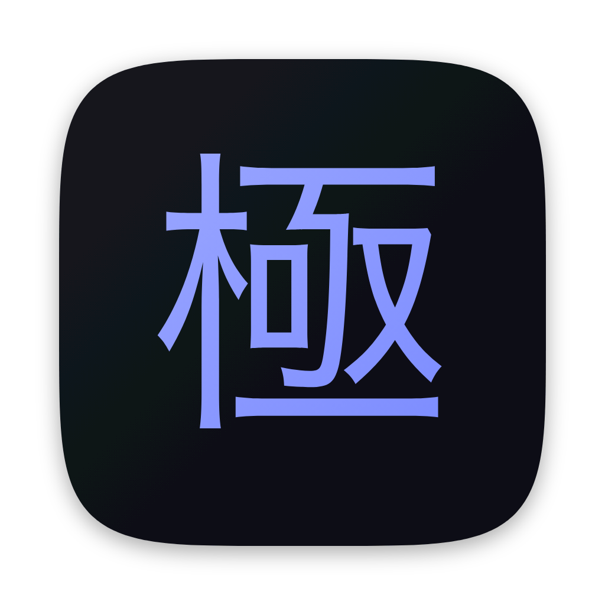
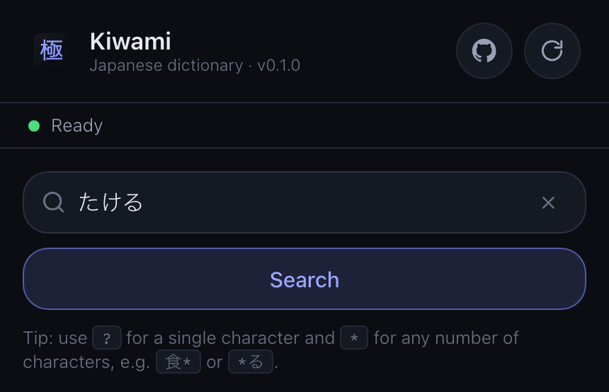
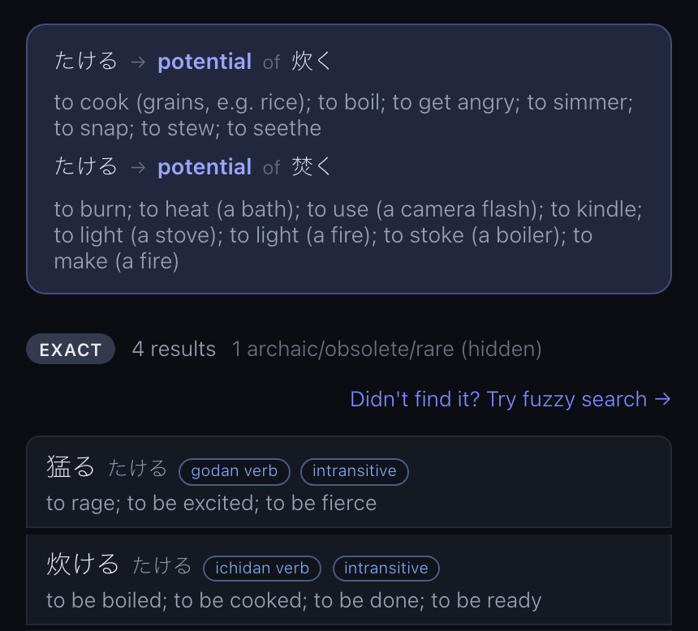
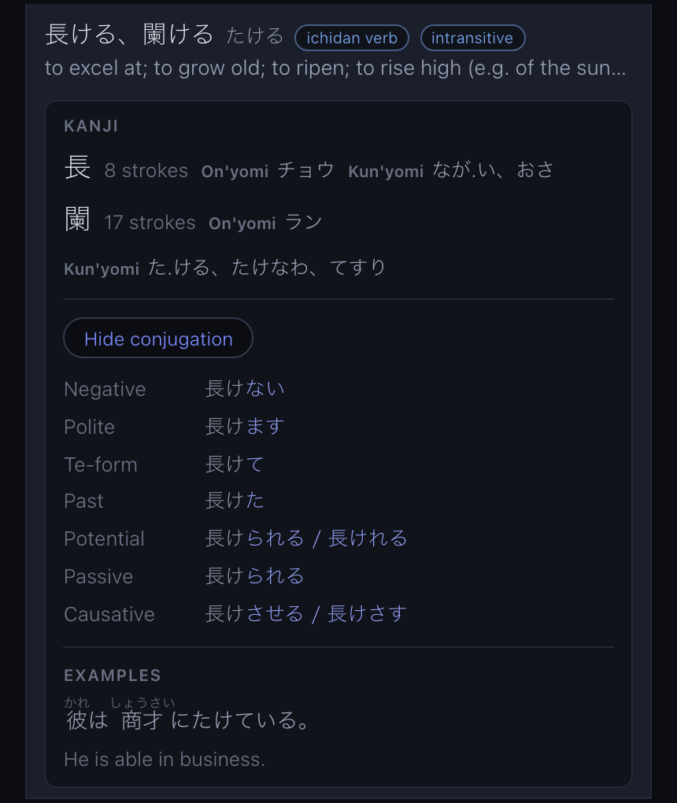
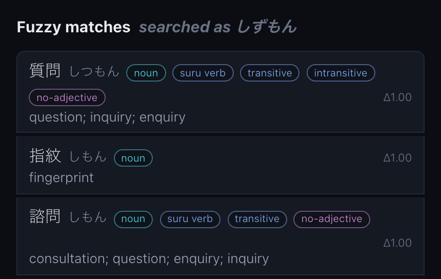
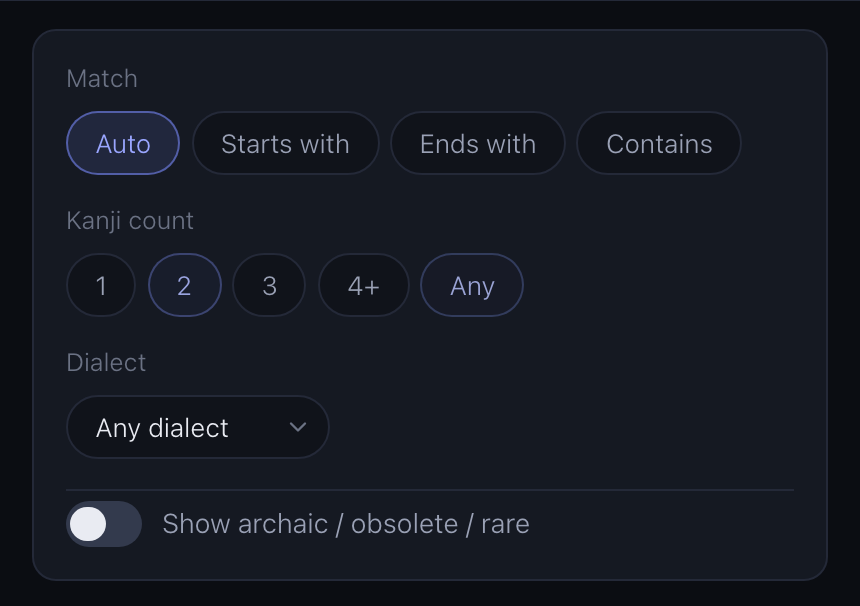
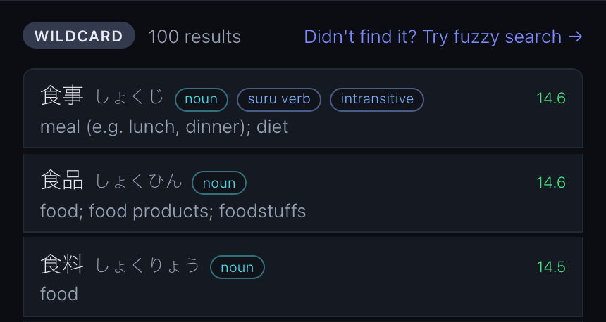
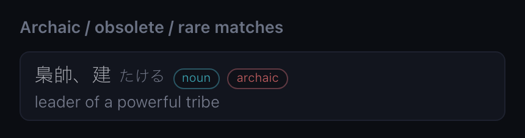

<div align="center">



# Kiwami (極)

**A Japanese dictionary for the word you can't quite spell.**

You heard a word, or saw it conjugated, or half-remember the kanji. Kiwami finds it from that —
no exact dictionary form required. It runs entirely in your browser, offline, on the real JMdict
data: **218,000 entries, 13,100 kanji, 62,000 example sentences**.

### [→ Try it live](https://cobysy.github.io/kiwami/)

</div>

---

## Ready before you type

The whole dictionary is one compressed SQLite file (≈39 MB), downloaded once and cached on your
device. Every search after that is local: no server, no network, no account. Wildcards live in the
search box itself — `?` for a single character, `*` for any number.



## Type the form you actually saw

Real Japanese text is full of conjugated verbs that no dictionary lists. Type one and Kiwami walks
it back — 食べた → 食べる, たける → the potential form of 炊く and 焚く — and names the
transformation it applied, so you get the pattern and not just the answer.



## Tap a word for the whole picture

One tap expands an entry into its kanji breakdown (stroke count, on'yomi, kun'yomi), a full
conjugation table for verbs and adjectives, and real example sentences from Tatoeba with furigana
over the kanji.



## Heard it wrong? Search by sound

Type what you thought you heard, and if nothing matches exactly, fuzzy search scores every reading
in the dictionary against yours — knowing which mistakes are cheap. Dakuten, long vowels, doubled
consonants and acoustically-close mora count as fractions of a difference, so しずもん still lands
on 質問. Each match shows the distance (Δ) it scored. It is opt-in and never an automatic
fallback: exact results stay exact.



## Narrow it down

Match mode, kanji count and dialect (Kansai-ben, Tōhoku-ben and the rest) filter any search,
wildcards included — which is how "starts with 食, two kanji" becomes the word you meant.





## Archaic words labelled, not hidden

Rare, obsolete and archaic entries are exactly what you need when you hit one in an old text, and
noise the rest of the time. Kiwami keeps them out of the main ranking and behind a switch — with a
count, so you always know they are there.



---

## Status

Under active development. Everything above is live today. Next up: dedicated entry and kanji views,
and favourites/history kept on-device and synced through your own iCloud or Google account — still
no server, still no sign-up. See [PLAN.md](PLAN.md) for the roadmap.

## Development

```sh
npm install          # postinstall also copies the sql.js wasm + kuromoji dictionary into public/
npm run build:db     # build public/dictionary.db.zst from the JMdict / KANJIDIC / Tatoeba sources
npm run dev          # Vite dev server
npm test             # the cross-driver dictionary suite (Node + browser)
npm run screenshot   # regenerate this README's media/shot-*.png images from the running app
```

- [README-DICTIONARY-BUILD.md](README-DICTIONARY-BUILD.md) — the dictionary build pipeline and its data sources.
- [README-DICTIONARY.md](README-DICTIONARY.md) — the dictionary engine (query layer + platform drivers) built on top of that database.
- [PLAN.md](PLAN.md) — the product plan and implementation roadmap.

## License

This project's source code is licensed under the [MIT License](LICENSE).

Bundled dictionary data and libraries come from third-party sources under their own licenses:

- **[JMdict](https://www.edrdg.org/jmdict/j_jmdict.html)** (JMdict_e), from the [Electronic Dictionary Research and Development Group](https://www.edrdg.org/) — [CC BY-SA 4.0](https://creativecommons.org/licenses/by-sa/4.0/)
- **[Tatoeba](https://tatoeba.org/)** example sentences — [CC BY 2.0 FR](https://creativecommons.org/licenses/by/2.0/fr/)
- **[kuromoji.js](https://github.com/takuyaa/kuromoji.js)** and its bundled IPADIC dictionary data — Apache 2.0 / LGPL
- **[jconj-js](https://github.com/cobysy/jconj-js)**, a JS/TS port of the JMdictDB project's table-based verb/adjective conjugator ([yamagoya/jconj](https://github.com/yamagoya/jconj)) — MIT

See [NOTICE.md](NOTICE.md) for what each is used for.
