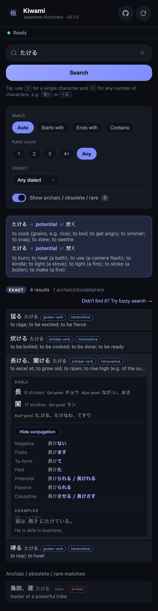

# Kiwami (極)

A Japanese smart dictionary to find a word from how it sounds.

Kiwami is real and running today, under active development, a working dictionary you can search right now: **[https://cobysy.github.io/kiwami/](https://cobysy.github.io/kiwami/)**

- Deconjugation — type a conjugated verb (食べた) and it points you to the dictionary form (食べる)
- Archaic/rare words labeled, not hidden
- Wildcard search (食*, *る)
- Kanji-count filter
- Furigana you can toggle off
- Favourites/history that sync across your own devices — no account, no server

Regenerate this screenshot with `npm run screenshot` (see [scripts/screenshot.mjs](scripts/screenshot.mjs); requires `public/dictionary.db` — run `npm run build:db` first if missing).

## Documentation

- See [PLAN.md](PLAN.md) for the product plan and implementation roadmap.
- See [README-DICTIONARY-BUILD.md](README-DICTIONARY-BUILD.md) for the detailed dictionary build pipeline and data sources.
- See [README-DICTIONARY.md](README-DICTIONARY.md) for the dictionary engine (query layer + platform drivers) built on top of that database.

## License

This project's source code is licensed under the [MIT License](LICENSE).

Bundled dictionary data and libraries come from third-party sources under their own licenses:

- **[JMdict](https://www.edrdg.org/jmdict/j_jmdict.html)** (JMdict_e), from the [Electronic Dictionary Research and Development Group](https://www.edrdg.org/) — [CC BY-SA 4.0](https://creativecommons.org/licenses/by-sa/4.0/)
- **[Tatoeba](https://tatoeba.org/)** example sentences — [CC BY 2.0 FR](https://creativecommons.org/licenses/by/2.0/fr/)
- **[kuromoji.js](https://github.com/takuyaa/kuromoji.js)** and its bundled IPADIC dictionary data — Apache 2.0 / LGPL
- **[jconj-js](https://github.com/cobysy/jconj-js)**, a JS/TS port of the JMdictDB project's table-based verb/adjective conjugator ([yamagoya/jconj](https://github.com/yamagoya/jconj)) — MIT

See [NOTICE.md](NOTICE.md) for what each is used for.
