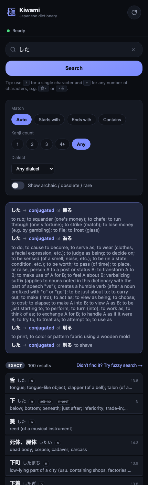

# Kiwami (極)

A Japanese smart dictionary to find a word from how it sounds.

- Deconjugation — type a conjugated verb (食べた) and it points you to the dictionary form (食べる)
- Archaic/rare words labeled, not hidden
- Wildcard search (食*, *る)
- Kanji-count filter
- Furigana you can toggle off
- Favourites/history that sync across your own devices — no account, no server

Regenerate this screenshot with `npm run screenshot` (see [scripts/screenshot.mjs](scripts/screenshot.mjs); requires `public/dictionary.db` — run `npm run build:db` first if missing).

## Documentation

- See [PLAN.md](PLAN.md) for the product plan and implementation roadmap.
- See [README-DICTIONARY-BUILD.md](README-DICTIONARY-BUILD.md) for the detailed dictionary build pipeline and data sources.
- See [README-DICTIONARY.md](README-DICTIONARY.md) for the dictionary engine (query layer + platform drivers) built on top of that database.

## License

This project's source code is licensed under the [MIT License](LICENSE). See [NOTICE.md](NOTICE.md) for third-party dictionary data attribution.
